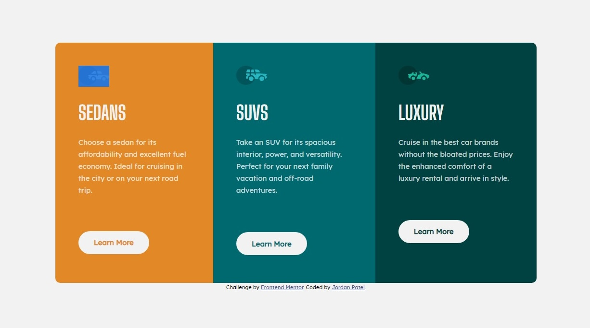

# Frontend Mentor - 3-column preview card component solution

This is a solution to the [3-column preview card component challenge on Frontend Mentor](https://www.frontendmentor.io/challenges/3column-preview-card-component-pH92eAR2-). Frontend Mentor challenges help you improve your coding skills by building realistic projects. 

Difficulty: Level 1 (newbie)

## Overview

### The challenge

Users should be able to:

- View the optimal layout depending on their device's screen size (note: only mobile (375px) and desktop (1440px) designs are provided)
- See hover states for interactive elements

### Links

- Live Site URL: [https://jordansgit.github.io/3-column-preview-card-component/](https://jordansgit.github.io/3-column-preview-card-component/)

### Built with

- HTML5
- CSS (Fully Responsive)

### Screenshot

